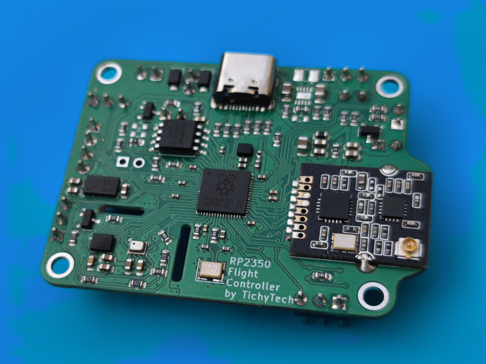
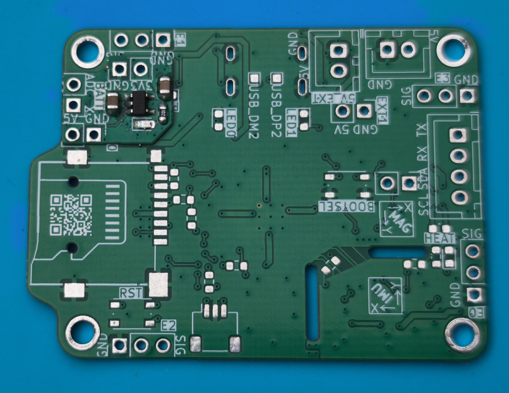

# About: 

This is my DIY quadcopter project, that builds on my previous [work](https://github.com/TichyTech/QuadcopterFlightController).

Since I wanted to understand the electronics/robotics product design process from idea to manufacturing, I designed my own flight controller board, with my own flight controller software and housed it in a custom 3D printed frame that I designed.

Look, it flies!!

# Project Overview

### Custom PCB

In order to have complete control over what is happening in the flight controller, I selected and sourced necessary SMD components and designed a custom [flight controller pcb](https://github.com/TichyTech/rp2350-flight-controller). I ordered the double sided PCB from a manufacturer as well as the components and put it all together using solder paste and hot plate. This was my first time soldering on this scale, but it turned out pretty good I would say!

To my surprise, the PCB design did not have any major flaws except for the fact, that the RT6150B chip I used for 3.3V power supply to stay close to the [Pi Pico 2 Design](https://datasheets.raspberrypi.com/pico/pico-2-datasheet.pdf) is basically impossible to source nowadays. I was lucky and found that I had all the necessary leads exposed, so that I could simply design a cute tiny solder-on module to bypass the original power supply using a linear regulator instead. This power module is based around the AP7366-33W5 linear regulator IC. I just added some decoupling capacitors and an indication LED to it. Here is the module and its placement on the flight controller PCB:

And finally, blink example!

To save some space, I also designed a custom power distribution board, which is really just  some copper to distribute the battery power and a 5V DC-Buck Converter based on the AP3211 IC to step down the battery voltage and power my flight controller. This chip is capable of providing up to 1.5A according to the datasheet!

The traces are kept unmasked, so that I can put solder on them and decrease their resistance, which leads to lower power losses and heat buildup. 

### Custom 3D printed frame

It took a lot of iterations to get this 3D printed frame right. In the previous design attempts, I struggled with motor caused vibrations creeping their way into the IMU and while the Gyroscope was still usable, the Accelerometer was not able to keep the drone perfectly upright. Therefore I made the drone a lot more sturdy, while also adding vibration dampers under the flight controller to help shield it from noise.

The vibration damping system consists of these 4 foam cylinders mounted between a base plate and the flight controller pcb as shown here:

This contraption is friction fitted and screwed into the main quadcopter body and also works to conceal and fix the wiring and escs below it.

It was also very difficult and time consuming to design the 3D printed frame, such that: 
1) It can house all the necessary components
2) Only screws, nuts and friction is necessary for assembly
3) It can be 3D printed well on an FDM printer
4) It can be assembled and dissasembled fairly comfortably
5) Does not look like rubish

In the end, after many iterations I converged to this:

And here, enjoy some renders:

# Hardware Overview

### Drivetrain
| Component|Specs |
|-|-|
| Motor | 2212 1000 KV Outrunner Motor |
| ESC   | Little Bee Blheli_S 40A 3-4S 8bit ESC |
| Propeller | 1045 Nylon Propellers |
| Battery | 3S 1300mAh 60C LiPo |

### Flight Controller

Flight Controller PCB highlights:
- Powering and Programming through USB-C even when battery powered
- RP2350 dual ARM core microcontroller running at 150MHz
- ICM-42605 Gyroscope and Accelerometer over SPI capable of up to 8kHz sampling rate
- NRF24L01+ with Low Noise Amplifier and Power Amplifier

For more info, see [https://github.com/TichyTech/rp2350-flight-controller](https://github.com/TichyTech/rp2350-flight-controller).

# Software Overview

The whole project relies on platformio for dependencies and compilation for ease of use.

The [flight controller](FlightController) runs on the two cores RP2350. 
The first core is used to poll the sensors for newest readings, estimate the attitude of the drone using quaternion EKF and based on the commands and PID controllers, stabilize the drone by driving the four motor ESCs. The second core is used for logging and communication - receiving commands and sending back telemetry via the NRF24L01 to the [remote controller](RemoteController).

The [drone plotter](DronePlotter) is a simple visualization application written using [Processing](https://processing.org/), which pulls data from the Remote Controller over serial interface. It also enables tuning controller gains via a simplified command line.

# Some more Photos

Here is the assembled quadcopter: 

And here from the bottom, where the battery resides under the neatly designed sliding cover:

Also, due to the addition of Blue Leds to the arms (which are a real pain to put there), it looks pretty sweet at night too:

